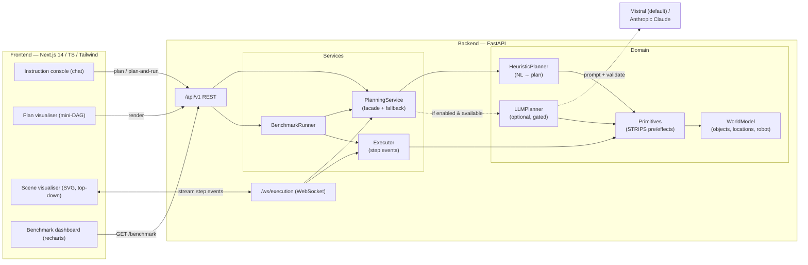

# LLM-Powered Robotic Task-Planning Agent

Give a tabletop robot a natural-language instruction — *"pick up the red block and
place it on the shelf"* — and watch it decompose the command into a sequence of
validated, executable **primitive actions**, then run them step-by-step against a
simulated tabletop world, animated live in the browser.

The planner has two interchangeable backends: an **always-available deterministic
heuristic/grammar parser** (no GPU, no model, no API key) and a **real LLM-backed
planner** — **Mistral by default** (`mistral-large-latest`), with **Anthropic
Claude** selectable as an alternative. The LLM planner uses structured JSON output,
validates the model's action list against the primitive catalog, and injects
similar prior plans (pgvector few-shot memory) as context. The system degrades
gracefully: if the LLM is unavailable or returns an invalid plan, it silently
falls back to the heuristic planner and says so truthfully.

The app is **multi-user and stateful**: every `/api/v1/**` REST route and the
`/ws/**` WebSocket require a **Supabase JWT** (`/health` + `/metrics` stay
public), and each user gets their **own world + executor per session** via a
`SessionRegistry`. Sessions, runs (incl. benchmark success rate) and plan memory
persist to **Supabase Postgres** when configured.

> **Runs anywhere offline.** The full backend boots and its test suite passes
> with only the pinned base dependencies and **no** database, no LLM key, no
> `torch`/`transformers`/`mistralai`/`anthropic` — auth is verified with the
> Python standard library, persistence falls back to in-memory, and the heuristic
> planner is always available. Tests mint their own JWT and run green keyless.

---

## Highlights

- **NL → plan → execution** end-to-end vertical slice, fully wired together.
- **Deterministic heuristic planner**: entity/relation/verb extraction → grounding
  to concrete object/location ids → precondition-aware primitive expansion
  (including auto-unstacking and cross-clause pronoun resolution).
- **STRIPS-like world & primitives** with explicit preconditions/effects, and a
  **plan validator** that dry-runs plans against a cloned world and rejects
  ungrounded/illegal plans.
- **Real LLM planner** that emits structured JSON actions, validated against the
  same primitive schema. **Mistral** (`mistral-large-latest`, `response_format=
  json_object`) is the default backend; **Anthropic Claude** (`claude-opus-4-8`,
  adaptive thinking + JSON-schema output) is selectable via `LLM_BACKEND=anthropic`.
- **Always-enforced Supabase JWT auth** (stdlib HS256 verification — no `pyjwt`),
  **per-user/per-session isolation** (`SessionRegistry`), and **Supabase Postgres
  persistence** (sessions, runs, **pgvector plan memory** for few-shot retrieval),
  all import-guarded with in-memory / heuristic fallbacks.
- **20-command benchmark** across 3 scenes with a **100% task-completion rate**
  on the heuristic planner (see [Benchmark](#benchmark)).
- **Polished Next.js 14 dashboard**: chat console, plan mini-DAG visualiser, a
  top-down SVG scene that animates over WebSocket, execution timeline, and a
  benchmark dashboard with a completion-rate gauge and recharts breakdown.

---

## Architecture



**Planning pipeline (heuristic):**

```
instruction
   │ 1. segment into clauses  ("then", "and then", ",", ";")
   ▼
clauses
   │ 2. extract verbs / colors / shapes / destination prepositions
   ▼
typed phrases
   │ 3. ground noun phrases → concrete object/location ids
   ▼
grounded clauses
   │ 4. expand to precondition-correct primitives
   │    (move_to → pick → move_to → place, + auto-unstack)
   ▼
ordered plan ──► validate against cloned world ──► execute step-by-step
```

---

## Tech stack

| Layer       | Technology                                                              |
| ----------- | ----------------------------------------------------------------------- |
| Backend     | Python 3.11, FastAPI, pydantic v2 / pydantic-settings, uvicorn, websockets |
| Domain      | Custom STRIPS-like world model, heuristic NL parser, plan validator     |
| Real LLM    | Mistral (`mistral-large-latest`, JSON output) by default; Anthropic Claude (`claude-opus-4-8`) alternative |
| Auth        | Supabase JWT (stdlib HS256 verification — no `pyjwt`)                    |
| Persistence | Supabase Postgres via SQLAlchemy(async)+asyncpg + pgvector (import-guarded; in-memory fallback) |
| Frontend    | Next.js 14 (App Router), TypeScript strict, TailwindCSS, @tanstack/react-query, recharts, lucide-react |
| Realtime    | WebSocket (`/ws/execution`) streaming per-step events                   |
| DevOps      | Multi-stage Dockerfiles (non-root, healthchecks), docker-compose, Makefile |

---

## Project structure

```
02-llm-robotic-task-planning/
├── README.md  ·  docker-compose.yml  ·  Makefile  ·  .env.example  ·  .gitignore
├── infra/supabase/                   # schema.sql (RLS, pgvector) + setup README
├── backend/
│   ├── app/
│   │   ├── main.py                 # FastAPI factory + lifespan + routers + WS
│   │   ├── config.py               # pydantic-settings Settings
│   │   ├── api/
│   │   │   ├── deps.py             # AppState (repo + registry) + auth dependency
│   │   │   ├── ws.py               # /ws/execution streaming endpoint (auth'd)
│   │   │   └── routes/             # world, planning, benchmark, capabilities, sessions
│   │   ├── core/                   # logging.py, errors.py, auth.py (stdlib JWT), metrics.py
│   │   ├── db/                     # repository (abstract), memory_repo, sql_repo (guarded)
│   │   ├── schemas/                # pydantic request/response models
│   │   ├── services/               # executor, benchmark, planning_service, session_registry
│   │   └── domain/                 # world_model, primitives, planner, llm_planner, embeddings
│   ├── tests/                      # pytest: auth, plan, validation, execute, benchmark, WS, brain
│   ├── requirements.txt  ·  requirements-dev.txt  ·  pyproject.toml  ·  Dockerfile
│   └── .env.example
└── frontend/
    ├── src/
    │   ├── app/                    # layout.tsx, page.tsx (dashboard)
    │   ├── components/             # SceneVisualiser, PlanVisualiser, InstructionConsole,
    │   │   ├── ui/                 #   ExecutionTimeline, BenchmarkDashboard + ui primitives
    │   ├── hooks/                  # useExecutionSocket (WebSocket)
    │   ├── lib/                    # api.ts (typed client), types.ts, utils.ts
    │   └── styles/globals.css
    ├── package.json  ·  tsconfig.json  ·  tailwind.config.ts  ·  next.config.mjs
    └── Dockerfile  ·  .env.local.example
```

---

## Quickstart

### Local (two terminals)

**Backend** (Python 3.11):

```bash
cd backend
pip install -r requirements-dev.txt
uvicorn app.main:app --reload --port 8000
# → API at http://localhost:8000 , interactive docs at http://localhost:8000/docs
```

**Frontend** (Node 20):

```bash
cd frontend
cp .env.local.example .env.local        # set NEXT_PUBLIC_API_BASE_URL +
                                        # NEXT_PUBLIC_SUPABASE_URL / _ANON_KEY for login
npm install
npm run dev
# → UI at http://localhost:3000 (email/password login gate via Supabase)
```

### Docker Compose (full stack)

```bash
docker compose up --build
# Frontend: http://localhost:3000   Backend: http://localhost:8000
```

### Makefile shortcuts

```bash
make setup        # install backend + frontend deps
make dev-backend  # run FastAPI with autoreload
make dev-frontend # run Next.js dev server
make test         # backend pytest suite
make lint         # ruff + eslint + tsc
make benchmark    # print the 20-command completion rate
make up / make down
```

---

## API reference (`/api/v1`)

**Auth.** All `/api/v1/**` routes and the `/ws/**` WebSocket require a Supabase
JWT — send `Authorization: Bearer <access_token>` (REST) or `?token=<access_token>`
(WS). `/health`, `/metrics`, `/`, `/docs`, `/openapi.json`, `/redoc` are public.
Requests accept/return a `session_id`; omit it to create a new per-user session.

| Method | Path                              | Auth | Description                                                        |
| ------ | --------------------------------- | ---- | ----------------------------------------------------------------- |
| GET    | `/health`                         | —    | Liveness + LLM availability note (public).                        |
| GET    | `/metrics`                        | —    | Prometheus metrics (public, when instrumentator present).         |
| GET    | `/api/v1/world`                   | ✓    | Current session world state (`?session_id=`).                     |
| POST   | `/api/v1/world/reset`             | ✓    | Reset to a named scene, or load a custom scene description.        |
| GET    | `/api/v1/world/scenes`            | ✓    | List built-in scenes.                                             |
| POST   | `/api/v1/plan`                    | ✓    | Decompose an instruction into a validated plan.                   |
| POST   | `/api/v1/execute`                 | ✓    | Execute a (client-supplied) plan step-by-step; returns events.    |
| POST   | `/api/v1/plan-and-run`            | ✓    | Plan an instruction and execute it in one call.                   |
| GET    | `/api/v1/benchmark`               | ✓    | Run the 20-command suite (`?mode=heuristic\|llm\|auto`).           |
| POST   | `/api/v1/benchmark`               | ✓    | Run the suite with a body `{ "mode": "..." }`.                    |
| GET    | `/api/v1/capabilities`            | ✓    | Primitives, scenes, benchmark commands, modes, LLM status/backend.|
| POST   | `/api/v1/sessions`                | ✓    | Create a new per-user session.                                    |
| GET    | `/api/v1/sessions`                | ✓    | List the caller's sessions.                                       |
| GET    | `/api/v1/sessions/{id}/runs`      | ✓    | List runs (plan/execute/benchmark) for one session.              |
| GET    | `/api/v1/runs`                    | ✓    | List the caller's recent runs across sessions.                   |

**Example — plan and run (authenticated):**

```bash
curl -X POST http://localhost:8000/api/v1/plan-and-run \
  -H 'Content-Type: application/json' \
  -H "Authorization: Bearer $SUPABASE_ACCESS_TOKEN" \
  -d '{"instruction":"pick up the red block and place it on the shelf",
       "mode":"heuristic","reset_scene":"default"}'
```

### WebSocket events (`/ws/execution`)

Send one command, receive a typed stream:

```jsonc
// client → server
{ "instruction": "move the green ball to the bin", "mode": "heuristic", "reset_scene": "default" }
```

| Message `type` | Payload                                                       |
| -------------- | ------------------------------------------------------------- |
| `plan`         | The resolved plan + validation + planner used + notes.        |
| `world`        | The initial world snapshot before execution.                 |
| `step`         | One per executed primitive: action, args, pre/post snapshots, success. |
| `result`       | Final execution report (success, counts, final state).       |
| `error`        | An error message (bad plan, unknown scene, …).               |

You can also send an explicit `{ "plan": [ {action, args}, ... ] }` to execute a
pre-built plan without re-planning.

### Primitive action set

| Primitive       | Args        | Preconditions (abridged)                                       |
| --------------- | ----------- | -------------------------------------------------------------- |
| `move_to`       | `target`    | target is a known object/location.                            |
| `pick`          | `target`    | gripper open & empty, robot at target, target clear (graspable). |
| `place`         | `target`    | gripper holding an object, robot at target, target clear.      |
| `open_gripper`  | —           | gripper currently closed; drops any held object onto the table.|
| `close_gripper` | —           | gripper open and empty.                                       |
| `detect`        | `target`    | optional known target; perception only (no state change).      |
| `wait`          | `seconds`   | always valid (no-op delay).                                   |

---

## Configuration

| Variable               | Default                        | Description                                                   |
| ---------------------- | ------------------------------ | ------------------------------------------------------------ |
| `LOG_LEVEL`            | `INFO`                         | Logging level.                                               |
| `LOG_JSON`             | `false`                        | Emit JSON logs.                                              |
| `DEFAULT_SCENE`        | `default`                      | Initial scene (`default`, `stack`, `sorting`, `empty`).      |
| `CORS_ORIGINS`         | `["http://localhost:3000", …]` | Allowed front-end origins.                                   |
| `AUTH_REQUIRED`        | `true`                         | Enforce Supabase JWT on `/api/v1/**` + `/ws/**`.            |
| `SUPABASE_URL`         | *(empty)*                      | Supabase project URL.                                       |
| `SUPABASE_ANON_KEY`    | *(empty)*                      | Supabase anon public key.                                   |
| `SUPABASE_SERVICE_ROLE_KEY` | *(empty)*                 | Supabase service-role key (server-only).                    |
| `SUPABASE_JWT_SECRET`  | *(empty)*                      | HS256 secret used to verify user JWTs.                      |
| `DATABASE_URL`         | *(empty)*                      | `postgresql+asyncpg://…` Supabase Postgres DSN.             |
| `PERSISTENCE_BACKEND`  | `auto`                         | `auto` \| `supabase` \| `memory`.                            |
| `ENABLE_LLM`           | `true`                         | Master switch for the real-LLM planner.                      |
| `LLM_BACKEND`          | `mistral`                      | `mistral` (default) or `anthropic`.                          |
| `MISTRAL_API_KEY`      | *(empty)*                      | Required for the Mistral backend.                            |
| `MISTRAL_MODEL`        | `mistral-large-latest`         | Mistral model id.                                            |
| `ANTHROPIC_API_KEY`    | *(empty)*                      | Required for the Anthropic backend.                          |
| `ANTHROPIC_MODEL`      | `claude-opus-4-8`              | Anthropic model id.                                          |
| `LLM_MAX_TOKENS`       | `2048`                         | Max output tokens for the LLM planner.                       |
| `ENABLE_PLAN_MEMORY`   | `true`                         | Store/retrieve few-shot plans via pgvector.                  |
| `PLAN_MEMORY_TOP_K`    | `3`                            | Number of similar prior plans injected as context.           |
| `EMBEDDING_DIM`        | `384`                          | Embedding dimension (matches `vector(384)`).                 |
| `EMBEDDING_MODEL`      | `…/all-MiniLM-L6-v2`           | sentence-transformers model; hashing fallback if absent.     |
| `NEXT_PUBLIC_API_BASE_URL` | `http://localhost:8000`    | Frontend → backend base URL (build-time for Next.js).        |
| `NEXT_PUBLIC_SUPABASE_URL` | *(empty)*                  | Supabase URL for the browser login client.                  |
| `NEXT_PUBLIC_SUPABASE_ANON_KEY` | *(empty)*             | Supabase anon key for the browser login client.             |

See [`infra/supabase/README.md`](infra/supabase/README.md) for Supabase setup
(keys, `schema.sql`, RLS, pgvector) and the scaling model (shared Postgres
persistence; per-instance live session state → sticky routing).

---

## Benchmark

### Methodology

The suite is a **fixed set of 20 natural-language commands**, each paired with a
**scene** and an **expected-outcome predicate** (a check over the final world
state — e.g. *`red_block.on_top_of == shelf`*, *`green_ball.inside == bin`*, or
*robot is holding the object*). For each command the runner:

1. resets a fresh world to the command's scene,
2. plans the instruction with the selected planner (`heuristic` / `llm` / `auto`),
3. validates the plan (rejecting ungrounded/illegal plans),
4. executes the plan step-by-step against the world,
5. evaluates the expected predicate on the final state.

A command **passes** only if the plan is valid **and** every step executes
successfully **and** the expected outcome holds. The headline metric is the
**task-completion rate** = passes / 20. The commands deliberately exercise
single grasps, pick-and-place onto surfaces and into containers, named zones,
synonym verbs, block stacking, two-clause sequences (`then`), cross-clause
pronoun resolution (`pick up the red block then place it on the shelf`),
unstacking, and perception-only commands — across the `default`, `stack` and
`sorting` scenes.

### Sample results (heuristic planner)

`make benchmark` → **20 / 20 passed · completion rate 100%**

| #  | Command                                                            | Scene   | Steps | Result |
| -- | ----------------------------------------------------------------- | ------- | ----- | ------ |
| 1  | pick up the red block                                             | default | 2     | ✅ PASS |
| 2  | pick up the red block and place it on the shelf                   | default | 4     | ✅ PASS |
| 3  | put the blue block on the shelf                                   | default | 4     | ✅ PASS |
| 4  | move the green ball to the bin                                    | default | 4     | ✅ PASS |
| 5  | place the yellow cup in the bin                                   | default | 4     | ✅ PASS |
| 6  | put the red block in the left zone                                | default | 4     | ✅ PASS |
| 7  | move the blue block to the right zone                             | default | 4     | ✅ PASS |
| 8  | grab the green ball                                               | default | 2     | ✅ PASS |
| 9  | stack the red block on the blue block                            | default | 4     | ✅ PASS |
| 10 | pick up the red block then place it on the shelf                 | default | 4     | ✅ PASS |
| 11 | put the red block on the shelf and then put the blue block …      | default | 8     | ✅ PASS |
| 12 | move the green ball to the bin then move the blue block to the bin| default | 8     | ✅ PASS |
| 13 | detect the red block                                             | default | 1     | ✅ PASS |
| 14 | find the yellow cup                                              | default | 1     | ✅ PASS |
| 15 | take the red block from the top of the blue block               | stack   | 2     | ✅ PASS |
| 16 | put the red block on the shelf                                  | stack   | 4     | ✅ PASS |
| 17 | place the green block on the blue block                         | stack   | 8     | ✅ PASS |
| 18 | move all the red things to the left zone                        | sorting | 4     | ✅ PASS |
| 19 | put the green ball in the bin                                   | sorting | 4     | ✅ PASS |
| 20 | pick up the yellow cup and place it on the shelf                | sorting | 4     | ✅ PASS |

> The LLM planner is validated against the **same** suite and predicates; with
> `ENABLE_LLM=true` and a key, run `GET /api/v1/benchmark?mode=llm` (or `auto`).
> Because the LLM output is validated against the primitive schema and falls back
> to the heuristic planner on any failure, the suite is robust to model variance.

---

## What's real vs simulated (and how to enable the real LLM)

| Component            | In this repo                                                                 |
| -------------------- | ---------------------------------------------------------------------------- |
| Tabletop world       | **Simulated** — a deterministic STRIPS-like kinematic model (no Gazebo/ROS2).|
| Robot / gripper      | **Simulated** — pose + holding state, updated by primitive effects.          |
| Heuristic planner    | **Real** — a working grammar/heuristic NL→plan parser, always available.     |
| Plan validation      | **Real** — dry-run STRIPS validation against a cloned world.                 |
| Execution + events   | **Real** — step-by-step application with pre/post snapshots, streamed over WS.|
| LLM planner          | **Real** — Mistral (default) / Anthropic; enabled when a provider key is set. |
| Auth                 | **Real** — Supabase JWT, verified with the Python standard library.          |
| Persistence          | **Real** — Supabase Postgres + pgvector when configured; in-memory otherwise.|
| Plan memory          | **Real** — pgvector few-shot retrieval; deterministic hashing embedder fallback.|

**Enable the Mistral (default) backend:**

```bash
cd backend
pip install -r requirements.txt          # includes mistralai (or it uses httpx REST)
export ENABLE_LLM=true
export LLM_BACKEND=mistral
export MISTRAL_API_KEY=...                # your Mistral key
export MISTRAL_MODEL=mistral-large-latest # default
uvicorn app.main:app --reload --port 8000
```

The Mistral planner prompts the model with the primitive catalog + world state
(plus any similar prior plans from pgvector memory) and requests
`response_format={"type":"json_object"}`. The official `mistralai` SDK is used
when installed; otherwise the planner falls back to a direct REST call via
`httpx`. The output is parsed and **validated against the primitive schema and
the world**; on any error/invalid output it transparently falls back to the
heuristic planner, and the response/UI says so truthfully.

**Use the Anthropic (Claude) backend instead:**

```bash
export LLM_BACKEND=anthropic
export ANTHROPIC_API_KEY=sk-ant-...
export ANTHROPIC_MODEL=claude-opus-4-8   # default; adaptive thinking + JSON-schema output
```

The default **planner mode** is `llm` when a provider key is present, else
`heuristic`. Once available, the front-end **planner-mode toggle** lights up the
`LLM` option; otherwise it shows a "heuristic mode" note explaining why.

---

## Testing

```bash
cd backend
pytest                 # auth (401/200, bad signature), plan, validation,
                       # execute, benchmark, sessions/runs persistence + isolation,
                       # WebSocket (token via ?token=), embeddings, plan memory, …
ruff check app tests   # lint
```

All tests pass with **only** the pinned base dependencies — no database, no LLM
key, no `torch`/`transformers`/`mistralai`/`anthropic` (every optional import is
guarded). Tests mint their own valid HS256 JWT with a known test secret, so auth
is enforced and the suite is green offline and keyless.

---

## Roadmap

- Richer grounding (multi-object quantifiers: *"move **all** the red blocks"*).
- Geometric collision checks and a simple motion model for `move_to`.
- LLM self-repair loop: feed validation errors back to the model for one retry.
- Closed-loop replanning when a precondition fails mid-execution.
- Export executed plans to a ROS2 action sequence for a real/Gazebo robot.
- Persisted scenes and shareable benchmark runs.
"# LLM-Robotic-Task-Planning" 
